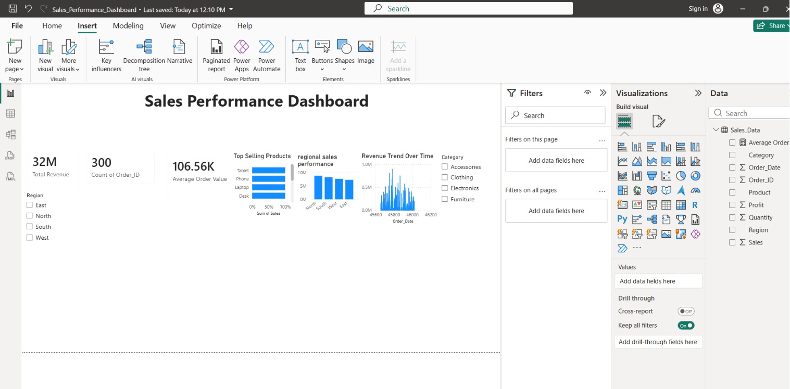

# Sales Performance Dashboard

## Overview
An interactive Power BI dashboard that analyzes business sales performance.

## Tools Used
- Power BI
- Excel
- DAX

## Dashboard Features
- Total Revenue tracking
- Total Orders analysis
- Average Order Value calculation
- Revenue trend analysis
- Top selling products
- Region-wise sales comparison
- Interactive slicers for Category and Region

## Key Metrics
- Total Revenue: 32M
- Total Orders: 300
- Average Order Value: 106.56K

## Dashboard Preview

